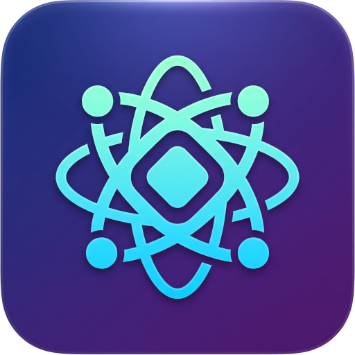
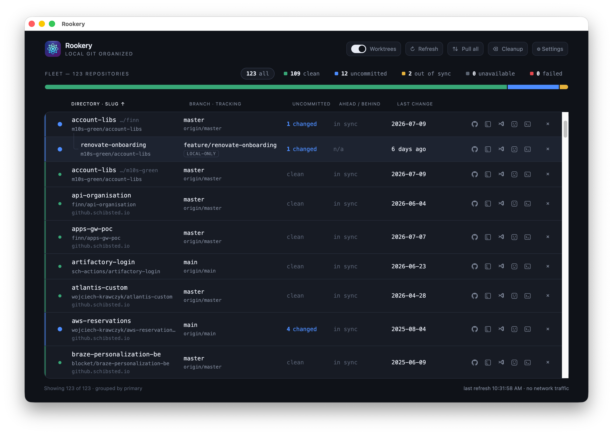

# Rookery - Local Git Organizer

[](https://github.com/wojtekk/rookery/actions/workflows/test.yml)
[](LICENSE)
[](https://github.com/wojtekk/rookery/releases/latest)

A local, single-user Electron app for developers who work across many
locally-cloned git repositories at once: it lists them and shows their state
at a glance — branch, tracking, uncommitted changes, ahead/behind — without
running `git status` in a terminal across every folder yourself.

<br clear="left">



It is **local-only by design**: it shells out to your already-installed system
`git` (using your existing credentials) to inspect and act on repositories, and
makes no network calls of its own. See
[`.specify/memory/constitution.md`](.specify/memory/constitution.md) for the
non-negotiable rules this project is built against.

Full requirements live in
[`specs/001-repo-dashboard/spec.md`](specs/001-repo-dashboard/spec.md); the
approved visual design is in
[`specs/001-repo-dashboard/design/README.md`](specs/001-repo-dashboard/design/README.md)
(with a static [interactive mockup](specs/001-repo-dashboard/design/dashboard-mockup.html)).
[`idea-box.md`](idea-box.md) is the original brain-dump this feature grew from —
several items there (pull, branch/worktree deletion, fetch-all, external-tool
launchers) are deliberately out of scope for this feature and deferred to later
ones.

## Download

Prebuilt macOS, Windows, and Linux builds are published on the
[GitHub Releases page](https://github.com/wojtekk/rookery/releases/latest) for
every tagged version. Builds are unsigned and unnotarized (see
[Releasing it](#releasing-it)), so your OS will warn you the first time you
open one:

- **macOS**: Gatekeeper blocks the `.dmg`'s app with "cannot verify developer."
  Right-click (or Control-click) the app → **Open** → **Open** again in the
  dialog. This is only needed the first time.
- **Windows**: SmartScreen blocks the `.exe` installer with "Windows protected
  your PC." Click **More info** → **Run anyway**.

## Current status

The MVP (point the app at a directory, see every repo grouped with worktrees,
sort and filter by state) is implemented. Managing observed directories from
the UI and an on-demand refresh button are the next increments — see
[`specs/001-repo-dashboard/tasks.md`](specs/001-repo-dashboard/tasks.md) for
the full task breakdown and what's done vs. pending.

Until directory management ships, observed directories are configured by
hand in the settings file (see [Running it locally](#running-it-locally)).

### Custom action launchers (feature 002)

Each repository row has a **⋮ menu of configurable launchers** — open the repo in
your editor, on its GitHub page, in Finder or a terminal, etc. Actions are managed
in Settings (icon + name + command) and seeded with sensible defaults on first run.
A command is a template run through your login shell, with the row's path (`${1}`)
and raw remote URL (`${2}`) passed as **shell positional parameters** — never spliced
into the command text — so repository values can't be interpreted as commands
(Constitution v1.4.0). See
[`specs/002-custom-action-launchers/`](specs/002-custom-action-launchers/).

### Clone (feature 027)

The header **Clone** action opens a dialog to clone a remote repository onto disk.
Search autocompletes across every repository you can access — discovered via the
optional system **`gh` CLI** (using its own existing authentication; the app never
handles a token) — or you can paste an HTTPS/SSH URL directly, which always works
even without `gh` installed. Pick a destination from your watched directories or
browse to a new one; on success the new repo's parent directory starts being
watched automatically so it shows up right away. See
[`specs/027-clone-repository/`](specs/027-clone-repository/).

## Top-level architecture

Standard Electron three-context split, plus a `shared/` module for the types
that cross the IPC boundary:

```text
src/
├── shared/
│   └── types.ts        # Row, Repository, WorkingTree(Entry), Head, Remote, Settings, RowState
├── main/                # Node context — the only place that touches git or the filesystem
│   ├── main.ts          # BrowserWindow, IPC handlers
│   ├── config.ts        # settings.json load/save (atomic write) in Electron's userData dir
│   ├── scan.ts          # walks observed dirs (1 level), bounded-concurrency + per-family timeout
│   └── git/
│       ├── probe.ts     # shells out to system git (--no-optional-locks, read-only)
│       ├── parse.ts     # pure: porcelain v2 / worktree-list / remote-url parsing
│       └── identity.ts  # pure: canonical identity, dedup, primary/worktree family grouping
├── preload/
│   └── preload.ts       # contextBridge: exposes a typed API as window.repoDashboard
└── renderer/             # Chromium context — no Node access, no filesystem, no git
    ├── renderer.ts       # bootstrap; owns view state (sort, state filter, worktree toggle)
    ├── index.html / styles.css
    └── view/
        ├── sort.ts       # pure: sort dimensions + deterministic tie-break
        ├── filter.ts     # pure: RowState derivation + state/worktree filtering
        ├── table.ts      # renders rows (state indicator, branch/tracking, counts, tooltip)
        ├── summary.ts    # fleet composition bar + state-filter chips
        └── toolbar.ts    # command bar controls
```

**Why it's split this way**: `contextIsolation: true`, `nodeIntegration: false`,
`sandbox: true` — the renderer can only reach the system through the typed
`window.repoDashboard` API in `preload.ts` (contract:
[`specs/001-repo-dashboard/contracts/ipc-api.md`](specs/001-repo-dashboard/contracts/ipc-api.md)).
All git/filesystem work lives in `main/`. Within `main/git/`, the actual
subprocess calls (`probe.ts`) are kept separate from the pure parsing
(`parse.ts`) and identity/grouping logic (`identity.ts`) — same for
`renderer/view/sort.ts` and `filter.ts` — so the core logic is unit-testable
with `node:test` without spinning up Electron at all (see `tests/`).

Data flow for a refresh: `renderer.ts` calls `refresh()` over IPC → `scan.ts`
walks the observed directories and probes each working tree
(`git/probe.ts` → `git/parse.ts` → `git/identity.ts`, exact commands documented in
[`contracts/git-probe.md`](specs/001-repo-dashboard/contracts/git-probe.md)) → the
resulting `Row[]` snapshot returns to the renderer, which sorts
(`view/sort.ts`), filters (`view/filter.ts`), and renders (`view/table.ts`,
`view/summary.ts`) it — all client-side, so switching sort/filter never
re-probes git.

## Running it locally

```bash
pnpm install          # Electron + TypeScript only; no runtime deps beyond Electron
pnpm run build        # tsc (main/preload/renderer, two separate module targets) + copy static assets
pnpm start            # build, then launch Electron
pnpm test             # build, then run node:test over the pure-logic modules + read-only probe assertion
```

Requires system `git >= 2.15` on `PATH` (needed for `--no-optional-locks`).

Until the directory-management UI exists, seed the observed directories by
creating the settings file the app reads on launch:

```jsonc
// macOS: ~/Library/Application Support/git-manager/settings.json
{
  "observedDirectories": ["/absolute/path/to/a/folder/of/repos"],
  "sortDimension": "slug",
  "sortDirection": "asc",
  "showWorktrees": true,
  "defaultHost": "github.com"
}
```

## Contributing

This project is developed with GitHub's [Spec Kit](https://github.com/github/spec-kit)
workflow — every feature has a spec, a plan, and a task breakdown before code
is written. Contributions are expected to follow the same process rather than
landing as an unplanned pull request:

1. `specs/<NNN-feature-name>/` holds `spec.md` (requirements), `plan.md`
   (architecture/tech decisions), `tasks.md` (the checklist), and supporting
   docs (`data-model.md`, `contracts/`, `research.md`, `quickstart.md`).
2. Work happens in a git worktree under `.worktrees/`, never on `main`
   directly — `main` stays clean and checked out at all times.
3. [`.specify/memory/constitution.md`](.specify/memory/constitution.md) is
   non-negotiable: system git only (no bundled git/credentials), read-only
   background activity, no silent conflict resolution, always-observable
   state, local-only with no telemetry. Any change touching a mutating
   operation, background behavior, or network activity must be checked
   against it.
4. Pure logic (parsing, identity/grouping, sort, filter) stays
   dependency-free and gets a `node:test` in `tests/`; a change to a
   mutating or safety-relevant code path should leave at least one runnable
   check that fails if the guard breaks.
5. Keep diffs surgical — match existing style, don't refactor adjacent code
   you didn't need to touch, and don't add a dependency where a few lines of
   platform/stdlib code will do.

Before opening a change: `pnpm run build && pnpm test` must pass, and if it
touches the UI, exercise it against a real directory of repos (there's no
automated UI test suite by design — `quickstart.md` in each feature's spec
folder has the manual validation scenarios).

For a large change, open an issue first to agree on the approach before
writing code — small fixes can go straight to a pull request. Every push and
pull request runs the test suite automatically (see the Test badge above);
a pull request should have a green check before it's considered for merge.

## License

Rookery is licensed under the **MIT License, modified by the Commons Clause
License Condition 1.0** — see [`LICENSE`](LICENSE) for the full text. In
plain language: anyone, including businesses, is free to use, run, modify,
and contribute to the project; what's **not** permitted is selling the
software itself, or offering a product or service whose value comes
substantially from it, for a fee. This makes Rookery **source-available**
rather than an OSI-approved open-source license — the sales restriction is
exactly what the Open Source Definition disallows.

## Releasing it

Pushing a `v<major>.<minor>.<patch>` tag (e.g. `v1.2.0`) triggers
[`.github/workflows/release.yml`](.github/workflows/release.yml): it builds
unsigned macOS, Windows, and Linux artifacts with
[`electron-builder`](https://www.electron.build/) in parallel, and only if
**all three** platforms succeed does it publish a single GitHub Release for
that tag with all three attached (`rookery-<version>.dmg`,
`rookery-<version>-setup.exe`, `rookery-<version>.AppImage`) — if any
platform fails, no release is created or updated. Re-pushing the same tag
replaces that release's assets rather than duplicating them.

To cut a release, run one command from `main`:

```bash
pnpm version 1.2.0        # or: patch / minor / major / prerelease --preid=alpha
```

This runs the test suite first and aborts if it fails (`preversion`), then
bumps `package.json`, commits (`vX.Y.Z`), tags, and pushes both the commit
and the tag (`postversion`) — which is what actually triggers the workflow
above.
